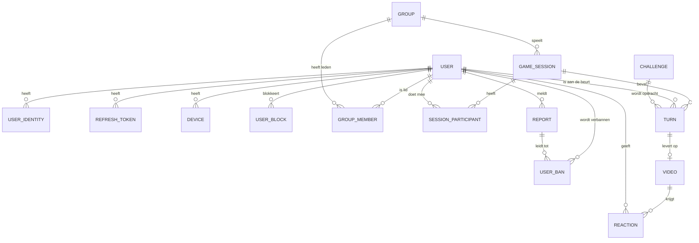

# 🍺 ChugNOW

### *Maak van je avond een spel*

> **Een onverwacht groepsspel dat de hele avond doorgaat.**

---

## Inhoudsopgave

1. [Het idee](#1-het-idee)
2. [Waarom is dit interessant?](#2-waarom-is-dit-interessant)
3. [Mogelijke functionaliteiten](#3-mogelijke-functionaliteiten)
4. [Verdienmodel](#4-verdienmodel)
5. [Marktanalyse](#5-marktanalyse)
6. [Mogelijke extra features](#6-mogelijke-extra-features)
7. [Belangrijkste risico](#7-belangrijkste-risico)
8. [Doelgroepen](#8-doelgroepen)
9. [Kerndriften & statussignalen](#9-kerndriften--statussignalen)
10. [Marktevaluatie](#10-marktevaluatie)
11. [Waardevormen, rompslomp-premie, modulariteit & bundeling](#11-waardevormen-rompslomp-premie-modulariteit--bundeling)
12. [Conclusie](#12-conclusie)
13. [Datamodel](#13-datamodel)
14. [Techstack](#14-techstack)

---

## 1. Het idee

ChugNOW is een **sociale party-app** voor vriendengroepen die samen een avond uitgaan, een huisfeest organiseren of simpelweg met elkaar willen drinken en een spel willen spelen. De app combineert het spontane karakter van **BeReal** met de sociale interactie van **Beer Buddy**.

Een vriendengroep kan in ChugNOW een **permanente groep** aanmaken (bijvoorbeeld voor een vaste vriendengroep) of tijdelijk een **nieuwe groep** starten voor één avond. Andere spelers doen eenvoudig mee via een unieke **groepscode**.

### Zo werkt het

1. De avond begint en de groep stelt een **interval** in: bijvoorbeeld elke **15, 30 of 60 minuten**.
2. ChugNOW kiest **willekeurig één speler** uit de groep.
3. Die speler krijgt een **onverwachte pushmelding** met een opdracht, bijvoorbeeld:

   > **"CHUG NOW! 🍺 Jij bent aan de beurt."**

4. De speler heeft een **beperkte tijd** om de opdracht uit te voeren en er een **korte video** van te maken.
5. De video wordt met de rest van de groep **gedeeld**.

Niemand weet vooraf wanneer hij of zij aan de beurt is. Dat zorgt voor **spanning en verwachting**: *wie krijgt de volgende melding?*

### Niet alleen alcohol

Appstores zijn vaak geen voorstander van apps die overmatig alcoholgebruik promoten. De oplossing: het concept hoeft niet uitsluitend om alcohol te draaien. Opdrachten kunnen ook bestaan uit:

- een gekke challenge
- een dansje
- een foto-opdracht
- een andere party challenge

Alcohol kan één van de mogelijke thema's zijn, maar is **niet noodzakelijk** om de app te gebruiken.

---

## 2. Waarom is dit interessant?

Het probleem is relatief simpel: tijdens een avond met vrienden wordt regelmatig een spel gespeeld, maar bestaande spellen zijn vaak losstaand en hebben voorbereiding nodig.

| Situatie | Probleem |
|---|---|
| Kaartspellen | Je moet kaarten meenemen |
| Party-apps | Iemand moet de app openen en het spel starten |
| Een gewone avond zonder spel | Er gebeurt simpelweg niets |

**ChugNOW maakt van de hele avond één doorlopend spel.**

### Wat maakt het bijzonder?

- 📵 **Geen constant telefoongebruik.** De groep legt de telefoon weg en gaat verder met de avond.
- 🔔 **Onverwachte activatie.** Op willekeurige momenten wordt het spel opnieuw geactiveerd door een pushmelding.
- 🎭 **Combinatie van sociale interactie, spanning en korte momenten van entertainment.**
- 📖 **Het "avondboek".** De video's worden achteraf onderdeel van een gezamenlijke tijdlijn, zodat de groep de volgende dag kan terugkijken wat er allemaal is gebeurd. De app heeft dus niet alleen tijdens de avond waarde.

---

## 3. Mogelijke functionaliteiten

De eerste versie kan relatief eenvoudig blijven:

- [ ] Groep aanmaken of joinen met een code
- [ ] Permanente en tijdelijke groepen
- [ ] Instelbare intervallen tussen opdrachten
- [ ] Willekeurige spelerselectie
- [ ] Pushmeldingen
- [ ] Korte video-opname vanuit de app
- [ ] Opdrachten/challenges
- [ ] Groepsfeed waarin video's verschijnen
- [ ] Score of leaderboard
- [ ] Historie van eerdere avonden
- [ ] Verschillende gamemodes

**Later** kunnen premiumfuncties worden toegevoegd, zoals exclusieve challenge packs, aangepaste opdrachten, verschillende gamemodes, statistieken, thema-avonden en grotere groepen.

💡 **Interessante uitbreiding:** een groep kan zelf regels instellen en zo zijn **eigen versie van ChugNOW** creëren.

---

## 4. Verdienmodel

Het meest voor de hand liggende model is **freemium**.

De basisversie is gratis, waardoor het eenvoudig is om een volledige vriendengroep kennis te laten maken met de app. Een groep hoeft dus niet eerst te betalen voordat iedereen kan meedoen.

- **Premium:** enkele euro's per maand of per jaar
- **Eenmalige aankoop:** bepaalde challenge packs

### Free vs. Premium

| 🆓 Free | ⭐ Premium |
|---|---|
| Groep aanmaken | Extra challenge packs |
| Basis challenges | Eigen challenges |
| Random opdrachten | Speciale gamemodes |
| Video's | Statistieken |
| | Thema-avonden |
| | Meer personalisatie |
| | Langere video-opslag |
| | Premium groepsfuncties |
| | Geen advertenties |

### Themabundels (eenmalige aankoop)

| Pack | Thema |
|---|---|
| 🍺 **Beer Night Pack** | Bieravond |
| 🎪 **Festival Pack** | Festivals |
| 🏠 **Houseparty Pack** | Huisfeesten |
| 🌀 **Chaos Pack** | Maximale chaos |
| 🏝️ **Vacation Pack** | Vakantie |

Hiermee kan steeds nieuwe content worden toegevoegd, waardoor gebruikers een reden hebben om terug te komen.

### Vergelijkbaar voorbeeld: Boomit

Een vergelijkbaar betaalmodel bestaat al bij party-apps. **Boomit** is gratis te downloaden en biedt in-app aankopen. Volgens Google Play heeft de app inmiddels **meer dan 100.000 downloads** en combineert ze onder andere Most Likely-vragen, challenges, groepsstemmen en een tikkende bom. Via een maandelijkse betaling krijg je extra vragenpakketten.

---

## 5. Marktanalyse

ChugNOW bevindt zich op het snijvlak van **drie bestaande markten**:

```
   Sociale apps  ─────┐
                      ├───▶  ChugNOW
   Party games   ─────┤
                      │
   Drinking/social apps ┘
```

### BeReal

Het concept van onverwachte notificaties is duidelijk geïnspireerd door BeReal. BeReal stuurt gebruikers elke dag op een willekeurig moment een melding, waarna ze binnen twee minuten een foto maken. Het succes van dit mechanisme laat zien dat onverwachte notificaties kunnen zorgen voor een gevoel van **urgentie en authenticiteit**.

**Verschil:** ChugNOW gebruikt een andere context. Niet één persoon die dagelijks iets deelt, maar een kleine vriendengroep die tijdens één avond gezamenlijk een spel speelt.

### Beer Buddy

Waarschijnlijk de belangrijkste bestaande concurrent vanuit het sociale-dranksegment. De app laat vrienden elkaar realtime informeren wanneer ze drinken en bevat een livekaart, foto's, drankregistratie, groepsstatistieken en inmiddels ook drinking games. Volgens de eigen website heeft Beer Buddy **meer dan 8 miljoen geregistreerde gebruikers** wereldwijd.

Dit betekent dat ChugNOW niet kan worden gepositioneerd als simpelweg *"een app waarmee vrienden samen drinken"*. Daarvoor is Beer Buddy al te sterk.

**Verschil:** Beer Buddy draait primair om het **delen en volgen van drankmomenten**, terwijl ChugNOW draait om een **doorlopende, onvoorspelbare groepsgame** waarbij iedere speler op ieder moment aan de beurt kan zijn.

### Boomit

Een tweede belangrijke concurrent. De app richt zich specifiek op partygames en combineert onder andere Most Likely-vragen, challenges, groepsstemmen en een tikkende bom.

**Verschil:** Boomit werkt vooral als een **actief spel dat je opstart en speelt**, terwijl ChugNOW bedoeld is als een spel dat **op de achtergrond van de avond blijft draaien**.

### Concurrentiepositie

| Concurrent | Sociaal | Partygame | Onverwachte opdrachten | Video's | Doorlopende avondgame |
|---|:---:|:---:|:---:|:---:|:---:|
| **Beer Buddy** | ✓✓✓ | ✓ | – | ✓ | – |
| **Boomit** | ✓✓ | ✓✓✓ | ✓ | – | – |
| **BeReal** | ✓✓✓ | – | ✓✓ | ✓ | – |
| **ChugNOW** | ✓✓✓ | ✓✓✓ | ✓✓✓ | ✓✓✓ | ✓✓✓ |

> De markt is dus niet leeg. Dat is tegelijkertijd een **risico én een voordeel**. Het idee hoeft geen compleet nieuwe categorie te creëren: de afzonderlijke mechanismen zijn al bewezen. De uitdaging is om ze op een manier te combineren die daadwerkelijk **leuker** is dan de bestaande alternatieven.

---

## 6. Mogelijke extra features

| Feature | Omschrijving |
|---|---|
| 🕵️ **Secret Missions** | Eén speler krijgt een geheime opdracht die de rest van de groep niet mag kennen. |
| ⛓️ **Chain Reaction** | Een opdracht voor één speler activeert vervolgens een nieuwe opdracht voor een andere speler. |
| 🗡️ **Betrayal** | Spelers krijgen opdrachten waarbij ze ongemerkt andere spelers moeten beïnvloeden. |
| 🎲 **Random Events** | Soms krijgt niet één speler, maar de hele groep onverwacht een gezamenlijke opdracht. |
| 📈 **Escalation** | De opdrachten worden gedurende de avond steeds uitdagender en chaotischer. |
| 📖 **The Night Story** | Alle video's en momenten worden automatisch verzameld in een overzicht van de hele avond. |

---

## 7. Belangrijkste risico

### ⚠️ Positionering

Het grootste risico is dat de app in de praktijk vooral wordt gezien als een *"app die zegt wanneer je moet atten"*. Dat is waarschijnlijk onvoldoende om gebruikers langdurig vast te houden.

Daarom moet het concept **breder worden dan alleen drinken**. De kern moet zijn:

> **"Een onverwacht groepsspel dat de hele avond doorgaat."**

Drinken kan daarbij één van de gamemodes zijn. Hierdoor wordt de potentiële doelgroep groter en wordt het product minder afhankelijk van alcohol.

### ⚠️ Appstorebeleid & user-generated content

- **Apple** staat apps niet toe die overmatige alcoholconsumptie aanmoedigen of minderjarigen aansporen alcohol te gebruiken.
- Omdat ChugNOW **gebruikersvideo's** laat uploaden, zijn ook de regels rond **user-generated content (UGC)** relevant. Google Play verlangt bijvoorbeeld **moderatie-, rapportage- en blokkeerfuncties** voor apps met UGC.

*(Zie het [datamodel](#13-datamodel): `Report`, `UserBan` en `UserBlock` zijn hier al op voorbereid.)*

---

## 8. Doelgroepen

- 🎓 Vriendengroepen van **18–30 jaar**
- 🏛️ Studentenverenigingen
- 🏠 Studentenhuizen
- 🎪 Festivalgangers
- 🎉 Huisfeestjes
- 🃏 Groepen die regelmatig partygames spelen
- 🏖️ Vakantie-/vriendengroepen

---

## 9. Kerndriften & statussignalen

**Kerndrift:** behoefte om te **verbinden**.

### Statussignalen

**Voor spelers**

- Laten zien dat je een challenge hebt voltooid
- Punten/score behalen binnen de vriendengroep
- Grappige video's creëren die later teruggekeken kunnen worden
- Sociale erkenning binnen de groep
- Degene zijn die een moeilijke of grappige challenge succesvol uitvoert

**Voor vriendengroepen**

- Een gezamenlijke activiteit tijdens een avond
- Herinneringen en video's van de avond verzamelen
- Eigen gamemodes en groepsregels creëren
- Een terugkerend spel voor de vriendengroep hebben

---

## 10. Marktevaluatie

| Criterium | Score | |
|---|:---:|---|
| Urgentie | **3** / 10 | `███░░░░░░░` |
| Marktgrootte | **8** / 10 | `████████░░` |
| Prijspotentieel | **3** / 10 | `███░░░░░░░` |
| Kosten van klantenacquisitie | **7** / 10 | `███████░░░` |
| Kosten van waardelevering | **7** / 10 | `███████░░░` |
| Uniekheid in aanbod | **6** / 10 | `██████░░░░` |
| Hoe snel op de markt | **8** / 10 | `████████░░` |
| Aanvangsinvestering | **6** / 10 | `██████░░░░` |
| Mogelijkheden voor upselling | **8** / 10 | `████████░░` |
| Evergreenpotentieel | **8** / 10 | `████████░░` |

**Sterk:** marktgrootte, snelheid naar de markt, upselling en evergreenpotentieel.
**Zwak:** urgentie en prijspotentieel. Het is een *nice-to-have* waarvoor mensen niet veel willen betalen.

---

## 11. Waardevormen, rompslomp-premie, modulariteit & bundeling

### Waardevormen

`Product` · `Dienstverlening` · `Gedeelde middelen` · `Abonnement`

### Rompslomp-premie

ChugNOW neemt vooral de **rompslomp van het bedenken en organiseren van een partygame** weg:

- ✅ Niemand hoeft vooraf een spel te bedenken.
- ✅ Niemand hoeft de opdrachten handmatig te selecteren.
- ✅ Niemand hoeft de beurtvolgorde bij te houden.
- ✅ Niemand hoeft steeds de telefoon vast te houden.
- ✅ De app bepaalt automatisch wie aan de beurt is.
- ✅ De app zorgt automatisch voor nieuwe opdrachten.
- ✅ Video's kunnen automatisch binnen de groep worden verzameld.

> De belangrijkste waarde: ChugNOW **automatiseert het organiseren van entertainment** tijdens een avond vrijwel volledig.

### Modulariteit

ChugNOW kan uit losse modules worden opgebouwd:

| Kern (MVP) | Uitbreiding |
|---|---|
| Groepsbeheer | Gamemodes |
| Random spelerselectie | Challenge packs |
| Timer- en notificatiesysteem | Premiumfunctionaliteiten |
| Challenge-systeem | Statistieken |
| Video-opnames | Eigen challenges |
| Groepsfeed | |
| Scores/leaderboards | |

Hierdoor kan het product klein beginnen (**groepen + random opdrachten + notificaties + video's**) en later worden uitgebreid.

### Bundeling

Verschillende onderdelen kunnen worden gebundeld tot complete spelervaringen. Zie [Verdienmodel](#4-verdienmodel) voor de indeling in **Free**, **Premium** en de **themabundels**.

---

## 12. Conclusie

ChugNOW is een mobiele partygame die een avond met vrienden verandert in **één doorlopend, onvoorspelbaar spel**. Door de willekeurige notificaties van **BeReal**, het sociale karakter van **Beer Buddy** en de partygame-elementen van apps zoals **Boomit** te combineren, ontstaat een concept dat gericht is op spanning, groepsinteractie en het creëren van herinneringen.

De markt is niet onbezet. Vooral Beer Buddy en Boomit zijn relevante concurrenten en laten zien dat gebruikers bereid zijn apps voor sociale/drink- en partygames te gebruiken. ChugNOW moet deze apps daarom niet één-op-één kopiëren, maar zich duidelijk onderscheiden met het concept van een **"game die de hele avond op de achtergrond doorgaat"**.

Voor een startup is het concept bovendien technisch relatief haalbaar. Een eerste **MVP** kan bestaan uit groepen, willekeurige selectie, timers, pushnotificaties, opdrachten en korte video's. Daarmee kan binnen een beperkte periode een echte test worden gedaan: een aantal vriendengroepen een avond laten spelen en meten of zij:

1. de app daadwerkelijk **leuk** vinden,
2. de app **opnieuw gebruiken**,
3. bereid zijn om **te betalen voor extra content**.

---

## 13. Datamodel

*De opmerkingen bij de velden zijn overgenomen zoals ze in het oorspronkelijke ontwerp stonden (deels Nederlands, deels Engels). Een `?` achter een veldnaam betekent dat het veld optioneel (nullable) is.*

### Overzicht (ERD)



---

### 👤 Gebruikers & moderatie

#### `User`

| Veld | Sleutel / type | Opmerking |
|---|---|---|
| `Id` | PK | |
| `Username` | unique | hoofdletterongevoelig (`citext`) |
| `Email` | unique | hoofdletterongevoelig (`citext`) |
| `PasswordHash?` | | leeg bij inloggen met Apple/Google |
| `DateOfBirth` | | |
| `Role` | enum | User / Moderator / Admin |
| `CreatedOn` | | |
| `UpdatedOn` | | |
| `DeletedOn?` | | |

#### `UserIdentity` *(social sign-in koppelingen)*

| Veld | Sleutel / type | Opmerking |
|---|---|---|
| `Id` | PK | |
| `UserId` | FK → `User` | |
| `Provider` | enum | Apple / Google |
| `ProviderUserId` | | stabiele id van de provider (bij Apple de "sub") |
| `Email?` | | e-mail volgens de provider (bij Apple mogelijk een private relay-adres) |
| `CreatedOn` | | |

**Constraints:**
- `Unique (Provider, ProviderUserId)`
- `Unique (UserId, Provider)`: max. één Apple- en één Google-koppeling per user

#### `RefreshToken` *(sessies voor JWT-auth, zie [Techstack](#14-techstack))*

| Veld | Sleutel / type | Opmerking |
|---|---|---|
| `Id` | PK | |
| `UserId` | FK → `User` | |
| `TokenHash` | unique | SHA-256 (hex) van het token; het token zelf wordt nooit opgeslagen |
| `CreatedOn` | | |
| `ExpiresOn` | | |
| `RevokedOn?` | | gevuld bij uitloggen of rotatie; hergebruik van een ingetrokken token trekt alle tokens van de user in |

#### `UserBan`

| Veld | Sleutel / type | Opmerking |
|---|---|---|
| `Id` | PK | |
| `UserId` | FK → `User` | de verbannen user |
| `Reason` | | |
| `ReportId?` | FK → `Report` | de melding waaruit de ban voortkwam |
| `BannedByUserId` | FK → `User` | moet Role Moderator of Admin hebben |
| `BannedOn` | | |
| `ExpiresOn?` | | `null` = permanent |
| `LiftedOn?` | | gevuld als een moderator de ban vroegtijdig opheft |
| `LiftedByUserId?` | FK → `User` | |

#### `UserBlock`

| Veld | Sleutel / type | Opmerking |
|---|---|---|
| `BlockerId` | PK, FK → `User` | |
| `BlockedId` | PK, FK → `User` | |
| `CreatedOn` | | |

#### `Report`

| Veld | Sleutel / type | Opmerking |
|---|---|---|
| `Id` | PK | |
| `ReporterUserId` | FK → `User` | |
| `TargetType` | enum | Video / User |
| `TargetId` | | wijst naar het type in `TargetType` (geen echte foreign key) |
| `Reason` | enum | Inappropriate / Harassment / Underage / Spam / Other |
| `Description` | | |
| `Status` | enum | Open / InReview / Resolved / Dismissed |
| `Action?` | enum | None / ContentRemoved / UserWarned / UserBanned |
| `ResolvedByUserId?` | FK → `User` | |
| `CreatedOn` | | |
| `ResolvedOn?` | | |

#### `Device`

| Veld | Sleutel / type | Opmerking |
|---|---|---|
| `Id` | PK | |
| `UserId` | FK → `User` | |
| `PushToken` | unique | |
| `Platform` | enum | iOS / Android |
| `LastSeenOn` | | used to clean up expired tokens |
| `CreatedOn` | | |

---

### 👥 Groepen

#### `Group`

| Veld | Sleutel / type | Opmerking |
|---|---|---|
| `Id` | PK | |
| `Name` | | |
| `Code` | unique | join code, hoofdletterongevoelig (`citext`) |
| `CreatedByUserId` | FK → `User` | |
| `IsPermanent` | | |
| `ExpiresOn?` | | only for temporary groups |
| `CreatedOn` | | |
| `UpdatedOn` | | |

**Regels:** maximaal 12 actieve leden (gratis versie), een tijdelijke groep verloopt 24 uur na aanmaken (`ExpiresOn`), de join-code heeft 6 tekens zonder `0/O/1/I/L`. Verlaat de enige eigenaar een groep met andere leden, dan wordt het langst aanwezige lid automatisch `Owner`.

#### `GroupMember`

| Veld | Sleutel / type | Opmerking |
|---|---|---|
| `GroupId` | PK, FK → `Group` | |
| `UserId` | PK, FK → `User` | |
| `Role` | enum | Owner / Member |
| `JoinedOn` | | |
| `LeftOn?` | | cleared again when the user rejoins |

---

### 🎮 Spel

#### `GameSession`

| Veld | Sleutel / type | Opmerking |
|---|---|---|
| `Id` | PK | |
| `GroupId` | FK → `Group` | |
| `CreatedByUserId` | FK → `User` | |
| `Status` | enum | Active / Paused / Ended |
| `IntervalMinutes` | | 15, 30 or 60 |
| `ResponseTimeSeconds` | | how long the player has to chug and upload the video |
| `NextTurnAt?` | | when the next player is picked (used by the scheduler) |
| `StartDate` | | |
| `EndDate?` | | |
| `CreatedOn` | | |

#### `SessionParticipant`

| Veld | Sleutel / type | Opmerking |
|---|---|---|
| `GameSessionId` | PK, FK → `GameSession` | |
| `UserId` | PK, FK → `User` | |
| `JoinedOn` | | |
| `IsActive` | | false when someone pauses or leaves; the random pick only uses active players |

#### `Challenge`

| Veld | Sleutel / type | Opmerking |
|---|---|---|
| `Id` | PK | |
| `Title` | | bv. "CHUG NOW!" |
| `Description` | | de opdracht die de speler ziet |
| `Type` | enum | Chug *(later: Dare, Dance, Photo, ...)* |
| `IsActive` | | uitzetten zonder te verwijderen |
| `CreatedOn` | | |

#### `Turn` *(één "CHUG NOW"-notificatie voor één speler)*

| Veld | Sleutel / type | Opmerking |
|---|---|---|
| `Id` | PK | |
| `GameSessionId` | FK → `GameSession` | |
| `UserId` | FK → `User` | must be a `SessionParticipant` of that session |
| `ChallengeId` | FK → `Challenge` | |
| `Status` | enum | Pending / Completed / Expired / Skipped |
| `AssignedOn` | | |
| `ExpiresOn` | | the server marks the turn Expired after this moment |
| `CompletedOn?` | | |

---

### 🎥 Video & interactie

#### `Video`

| Veld | Sleutel / type | Opmerking |
|---|---|---|
| `Id` | PK | |
| `TurnId` | FK → `Turn`, unique | one video per turn |
| `StorageKey` | | key in storage; signed URLs are generated on demand |
| `ThumbnailKey?` | | |
| `DurationSeconds` | | |
| `Status` | enum | Uploading / Ready / Removed |
| `ExpiresOn?` | | retention (GDPR) |
| `CreatedOn` | | |

#### `Reaction`

| Veld | Sleutel / type | Opmerking |
|---|---|---|
| `Id` | PK | |
| `VideoId` | FK → `Video` | |
| `UserId` | FK → `User` | |
| `Type` | enum | Fire / Laugh / Cheers |
| `CreatedOn` | | |

**Constraint:** `Unique (VideoId, UserId)`: één reactie per user per video.

---

### 📋 Enum-overzicht

| Enum | Waarden |
|---|---|
| `User.Role` | `User`, `Moderator`, `Admin` |
| `UserIdentity.Provider` | `Apple`, `Google` |
| `Device.Platform` | `iOS`, `Android` |
| `GroupMember.Role` | `Owner`, `Member` |
| `GameSession.Status` | `Active`, `Paused`, `Ended` |
| `GameSession.IntervalMinutes` | `15`, `30`, `60` |
| `Challenge.Type` | `Chug` |
| `Turn.Status` | `Pending`, `Completed`, `Expired`, `Skipped` |
| `Video.Status` | `Uploading`, `Ready`, `Removed` |
| `Reaction.Type` | `Fire`, `Laugh`, `Cheers` |
| `Report.TargetType` | `Video`, `User` |
| `Report.Reason` | `Inappropriate`, `Harassment`, `Underage`, `Spam`, `Other` |
| `Report.Status` | `Open`, `InReview`, `Resolved`, `Dismissed` |
| `Report.Action` | `None`, `ContentRemoved`, `UserWarned`, `UserBanned` |

---

## 14. Techstack

### Backend

De backend wordt geschreven in **C# (.NET)**. Het datamodel uit [hoofdstuk 13](#13-datamodel) is de basis voor het databaseschema; de entiteiten en enums worden daar 1-op-1 op afgestemd.

### Database

**PostgreSQL**, benaderd via **EF Core** (Npgsql-provider).

### Frontend

**React 19 + Vite + TypeScript + MUI** (zie `CLAUDE.md` voor de conventies).

### Authenticatie & leeftijd

- **JWT** met korte access tokens (15 min) en roterende **refresh tokens** (30 dagen, opgeslagen als hash in `RefreshToken`). Werkt voor web, PWA en native.
- Registratie en login met e-mail/wachtwoord (BCrypt); Apple/Google-login volgt via `UserIdentity`.
- **Minimumleeftijd: 18 jaar**, gecontroleerd bij registratie op `User.DateOfBirth`. Gebruikers met een actieve `UserBan` kunnen niet inloggen of verversen.

### Nog te bepalen

| Onderwerp | Toelichting |
|---|---|
| Hosting | Waarschijnlijk een eigen gehuurde VPS bij TransIP; nog niet definitief |
| Client voor pushmeldingen en camera | Web, PWA of native; bepaalt de push-aanpak (APNs / FCM) |
| Scheduler | Voor de MVP volstaat het pollen van `GameSession.NextTurnAt` (met `FOR UPDATE SKIP LOCKED` in Postgres); een job queue is pas later nodig |
| Videoopslag | Object storage met signed URLs (zie `Video.StorageKey`), zodat video's de schijf van de VPS niet vullen; aanbieder nog te kiezen |
| Back-ups | Dagelijkse dump of WAL-archivering van Postgres, opgeslagen buiten de VPS |
| Verval van permanente groepen | Tijdelijke groepen verlopen al na 24 uur; permanente hebben nu geen vervaldatum. Idee voor later, zodra het project verder is: ook permanente groepen laten verlopen (bijv. bij inactiviteit, met een nieuw veld als `LastActivityOn`) en dat koppelen aan het premium-abonnement (bijv. gratis groepen verlopen, premium-groepen blijven bestaan). Verlopen groepen moeten daarnaast fysiek worden opgeruimd door een job bij de scheduler |
| Leeftijdscontrole | Minimumleeftijd 18, gecontroleerd op de zelf opgegeven `User.DateOfBirth`. Er is geen verificatie van die opgave; of dat volstaat voor de appstores is nog niet uitgezocht |

---

<p align="center"><em>ChugNOW: geen spel dat je opstart, maar een spel dat jou vindt. 🍺</em></p>
